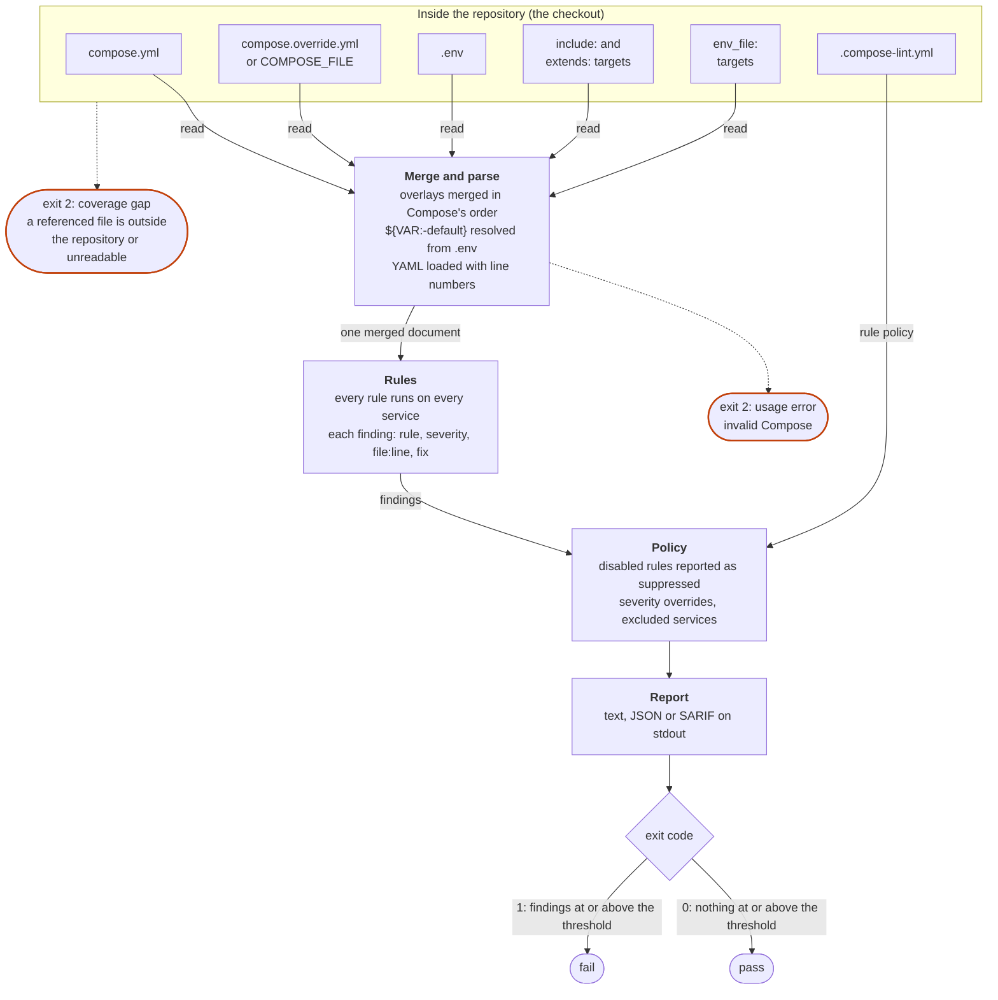
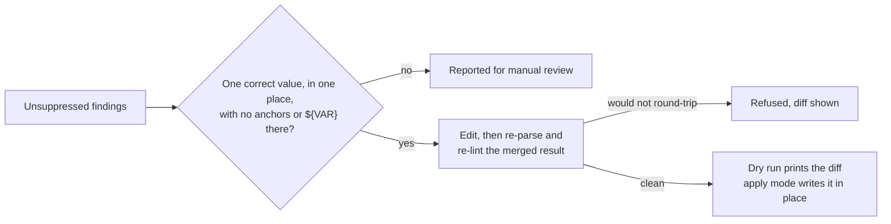

# How compose-lint works

compose-lint grades the configuration Compose would actually run, then turns the
result into an exit code. If it was meant to read part of the stack and could
not, the run fails. A pass always means everything was graded.

## A check run

1. **Inputs.** The file you name, or the one found in the working directory, plus
   everything `docker compose up` would read with it: the sibling override, the
   sibling `.env`, `include:` and cross-file `extends:` targets, and `env_file:`
   targets. Each must resolve inside the project. No registry, Docker daemon or
   image is ever contacted. [What a run reads](what-a-run-reads.md) has the full
   list and the flags that switch each source off.
2. **Merge and parse.** Overlays are merged in the order Compose uses, and
   `${VAR:-default}` resolves to what Compose would deploy. Line numbers are
   kept so every finding points at the line to change.
3. **Rules.** Every rule runs against every service. A rule's severity is derived
   from a fixed model, not picked per rule; see [Severity levels](severity.md).
4. **Policy.** [`.compose-lint.yml`](configuration.md) can disable a rule, override
   its severity, or exclude a service. A disabled rule's findings are still
   reported, marked suppressed with your reason. There are no inline suppression
   comments.
5. **Report and exit.** Findings go to stdout as text, JSON or SARIF. The run
   exits `1` if any finding is at or above `--fail-on` (default `high`), `0`
   otherwise.

The dashed paths are what makes the result safe to gate on. A part of the stack
compose-lint could not read is a coverage gap, and a coverage gap exits `2`, the
same as a usage error. It is never reported as a pass. The exit codes are part of
the [compatibility contract](compatibility.md).

## Where fix branches off

`compose-lint fix` edits only findings with exactly one right answer, and checks
each edit by linting the merged result before anything is written. A dry run is
the default. `--apply` writes with an atomic swap, and every edit that changes
how the stack behaves is labelled. [Fixing findings](fix.md) is the full
contract.
