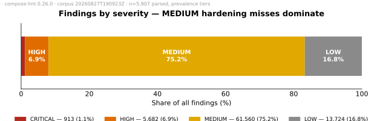
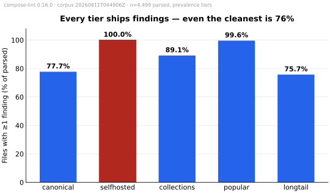

# State of Docker Compose Security

> This is the canonical, citable version of the State of Docker Compose Security report. Tracking issue: [#186](https://github.com/tmatens/compose-lint/issues/186).
>
> **Third edition.** Pinned to **compose-lint 0.26.0** and corpus run **`20260827T190923Z`** (11,111 files, 2026-08-27). Snapshot archive: `compose-lint-corpus-11111-20260827.tar.gz`, sha256 `049d2b5bf7167f0ca694aca23fa5483c761fbfccfa2ca7b78520a4ba8b3a5f98`.
>
> **What this edition can and cannot compare.** The 5,417 files behind the previous edition are a subset of this corpus, archived and relinted here with the new tool — so for the first time, a **same-files delta** is legitimate and is reported in [§ What changed since the last edition](#what-changed-since-the-last-edition): it isolates two weeks of rule-set change from corpus drift, exactly as the edition discipline demands. The 5,694 files new to this corpus (a deeper longtail sweep and the new overlay stratum) extend coverage; numbers over them are a new baseline, not a trend.
>
> This edition also folds in the previous edition's two 2026-08-27 revisions — the seven-tier composition re-cut and the statistical review — as its native methodology, and fixes a measurement artifact both revisions had to work around: files in which *nothing was linted* (obsolete Compose v1 layouts, structural fragments) are now a separate **skipped** population, never counted as "clean".

The first published empirical study of security misconfigurations in real-world Docker Compose files at corpus scale.

## TL;DR

- **99.2% of real-world Docker Compose files that lint carry at least one security finding** (5,860 of 5,907 parsed files across the five prevalence tiers; 47 clean files remain in a corpus of 11,111). Earlier editions reported ~90–91%; most of that gap was files in which nothing was actually linted, now bucketed honestly — see [§ Skipped is not clean](#skipped-is-not-clean).
- **Hardening practice is not improving over time.** Findings per service are flat across file age within every tier (corpus-wide: 5.98 for files authored in the last year, 5.96 at 1–3 years, 5.82 at 3+). The gap this report documents is how Compose files are written *now*, not legacy debt aging out. Replicated on 2,035 files fetched after the claim was first made.
- **Popular projects' files are the most exposed — because they're bigger, not sloppier.** Per *service*, every tier misses hardening at nearly the same rate (5.8–6.3 findings per service). Ordinary ≥50★ projects write 3.3 services per file against the templates' 1.5–2, so their files carry ~20 findings each, and 16.1% of them mount a host control socket (6.0% of their services — 2.5× the longtail rate per service).
- **Overlay files are a live, unhardened surface.** The new `overlay` stratum (3,579 `*.override.*` / `*.prod.*` / `*.dev.*` files) shows multi-environment Compose is current practice, overlays are mostly *full* parallel files rather than sparse patches — and dev/local variants carry literal credentials at 1.7× the full-file rate.
- **The same four rules lead every tier:** filesystem not read-only, no capability restrictions, no resource limits, privilege escalation not blocked — each fires on 97–99% of parsed files.
- **Every one of the 27 rules fires on real files.** None is dead, and there were zero crashes and zero timeouts across 11,111 linted files.

The framing is descriptive, not inferential. Read [§ What this study does NOT claim](#what-this-study-does-not-claim) before citing any number from this report.

## Methodology

### Corpus

The corpus lives outside the repo at `~/.cache/compose-lint-corpus/`. Each unique compose file is stored by content hash; an index maps content hash → source repo, path, blob SHA, tier, repo metadata, and the authored date of the captured content (`blob_authored_at`). The fetch + lint pipeline is in [`scripts/corpus/`](https://github.com/tmatens/compose-lint/tree/main/scripts/corpus). All numbers in this report come from corpus run `20260827T190923Z`.

The corpus is divided into eight tiers. Five carry prevalence claims; three are excluded from them (marked ✗) — reported in their own lanes, never blended. The attribution rules live in `scripts/corpus/retier.py`; they were **frozen before this edition's sweep** so the tier separations below are replicated on unseen data, not rediscovered ([§ replication](#the-replication-test)).

| Tier | Files | Prevalence | What it represents |
| --- | ---: | :---: | --- |
| `canonical` | 249 | ✓ | Official upstream examples (awesome-compose, bitnami, grafana, vaultwarden, …). *Do the examples people copy-paste ship insecure defaults?* |
| `selfhosted` | 596 | ✓ | Curated app-store / template-registry repos (CasaOS-AppStore, runtipi-appstore, Compose-Examples, dockge, …). Distinct threat model: home-LAN deployments, not cloud. |
| `collections` | 1,485 | ✓ | Template/recipe collection repos (≥20 corpus entries from one repo — vimagick/dockerfiles, laradock, ScaleTail, …): curated example libraries that happened to clear the popular tier's star bar. |
| `popular` | 1,231 | ✓ | Ordinary high-star (≥50) projects' **own** compose files. *What does production-adjacent code look like?* |
| `longtail` | 3,105 | ✓ | Stratified GitHub-code-search sweep across anchor terms × filenames × size buckets — the low-visibility mass of ordinary repos. This edition's sweep runs to the search API's 1,000-hit page cap per query (the previous editions' 200-hit cap skimmed GitHub's relevance-ranked head, which [over-sampled fossil files](#is-practice-improving-over-time)). *What does the median compose file in the wild look like?* |
| `overlay` | 3,579 | ✗ (own lane) | Merge fragments by design: `*.override.*` / `*.prod.*` / `*.dev.*` … variant files. Real deployment intent, but standalone lint rates aren't comparable to full files — see [§ The overlay lane](#the-overlay-lane). |
| `synthetic` | 554 | ✗ | Test *inputs* to compose tooling: files under test/fixture/e2e path segments anywhere, plus whole tool repos (docker/compose, podman-compose, kompose). Minimal snippets omit every hardening key by construction. |
| `lab` | 312 | ✗ | Deliberately-vulnerable environments: vulhub CVE reproductions, CTF challenge archives. Measured, they *dilute* rather than inflate — excluded on intent, not direction. |

Examples, templates, and demos are deliberately **not** synthetic: copy-paste material is exactly the population the `canonical`, `selfhosted`, and `collections` tiers exist to measure. Only test inputs and lab targets are excluded outright; overlays are excluded from *blending* but fully reported.

### Tool

All findings come from [compose-lint 0.26.0](https://github.com/tmatens/compose-lint/releases/tag/v0.26.0) — **27 rules** — installed from PyPI and running with `--fail-on low` (every severity reported, not gated). Each rule cites OWASP, CIS, or Docker docs; rule definitions are in [`docs/rules/`](rules/). Severities come from the derived two-axis model in [`docs/severity.md`](severity.md).

### Severity weights

For ranking rules by overall impact within a tier we use a doubled weighting: **CRITICAL = 8, HIGH = 4, MEDIUM = 2, LOW = 1**. The per-rule tables show raw hit counts and files-affected as well, so a reader who prefers a different curve can re-rank.

## Findings overview

Across the 5,907 parsed files in the five prevalence tiers (of their 6,666 total; 466 skipped as v1/fragment, 293 parse errors):

| Metric | Value |
| --- | ---: |
| Files with ≥1 finding | 5,860 (99.2%) |
| Files clean | 47 (0.8%) |
| Total findings | 81,879 |
| Findings per file (mean) | 13.9 |
| Findings per file (median) | 8 |
| Findings per file (max) | 323 |

Severity distribution across the 81,879 findings:

| Severity | Count | Share |
| --- | ---: | ---: |
| CRITICAL | 913 | 1.1% |
| HIGH | 5,682 | 6.9% |
| MEDIUM | 61,560 | 75.2% |
| LOW | 13,724 | 16.8% |



The MEDIUM-heavy distribution is a property of compose-lint's rule design, not of the corpus: the hardening misses that fire on nearly every file sit at MEDIUM. CRITICAL findings are rarer but not marginal: **10.6% of parsed files carry at least one CRITICAL finding**, and 7.8% carry a mounted host control socket specifically. Broadening to HIGH-or-above, **40.8% of parsed files carry at least one finding rated HIGH or CRITICAL** — the jump from the previous edition's 34.2% is mostly the credential rules reading `env_file:` contents they previously could not (see [the delta](#what-changed-since-the-last-edition)).

**LOW is one rule.** The 13,724 LOW findings are 99.8% [CL-0007](rules/CL-0007.md) (filesystem not read-only, 13,694); the remaining 30 come from [CL-0014](rules/CL-0014.md) (20), [CL-0017](rules/CL-0017.md) (5), and [CL-0022](rules/CL-0022.md) (5) — rules that fire only when a file explicitly opts out of a default. Read the LOW tier as "almost every file omits `read_only: true`".

## Skipped is not clean

**In plain terms:** some files exit the linter successfully with zero findings because there was *nothing in them to lint* — an obsolete Compose v1 layout (services at the top level, retired by Docker in 2023) or a structural fragment with no services. Earlier editions counted those as "clean", which quietly inflated the clean population; the previous edition's statistical review caught 438 of them by hand. The harness now separates them by construction.

This edition's skip population: **466 files in the prevalence tiers (447 Compose v1, 19 fragments)** — 7.0% of those tiers — concentrated in `longtail` (247) and `collections` (159). With them out of the denominator, genuinely clean files number **47 of 5,907 (0.8%)**: 46 in `longtail`, 1 in `collections`, and **zero** in `canonical`, `selfhosted`, or `popular`. The v1 population is fossil material — 61% of ≥5-year-old files vs ~1% of files under a year old — and the deeper sweep behind this edition surfaces proportionally far less of it.

## Per-tier breakdown

### Files with at least one finding

| Tier | Total | Parsed | Skipped | Parse-err | With findings | Clean | Rate (of parsed) | Findings per parsed file | Source repos |
| --- | ---: | ---: | ---: | ---: | ---: | ---: | ---: | ---: | ---: |
| `canonical` | 249 | 191 | 55 | 3 | 191 | 0 | **100%** | 13.21 | **8** |
| `selfhosted` | 596 | 596 | 0 | 0 | 596 | 0 | **100%** | 9.37 | **4** |
| `collections` | 1,485 | 1,310 | 159 | 16 | 1,309 | 1 | 99.9% | 9.98 | 16 |
| `popular` | 1,231 | 1,192 | 5 | 34 | 1,192 | 0 | **100%** | **19.93** | 734 |
| `longtail` | 3,105 | 2,618 | 247 | 240 | 2,572 | 46 | 98.2% | 14.11 | 2,583 |



The "Source repos" column matters as much as the file counts: a tier built on few repos describes those repos, however many files they contribute — `selfhosted` is four registries, `canonical` eight vendors. With the skip artifact gone, the with-findings rate has stopped being an interesting *axis of comparison* (every tier is at or near 100%, longtail's 98.2% carrying a repo-resampling interval of 97.7–98.7%); the discriminating numbers are findings per file, per service, and the acute-rule rates below.

### The fair comparison: per service, not per file

**In plain terms:** a file with six services has six chances to miss a hardening flag. Per-file comparisons across tiers whose files differ in size partly measure file size; the per-service view is the fair one.

| Tier | Services per file | Findings per **service** | Files w/ CRITICAL | Files w/ HIGH+ | Socket: files | Socket: **services** |
| --- | ---: | ---: | ---: | ---: | ---: | ---: |
| `canonical` | 2.14 | 6.19 | 8.9% | 45.5% | 7.3% | 4.4% |
| `selfhosted` | 1.50 | 6.26 | 9.4% | 31.4% | 5.2% | 3.5% |
| `collections` | 1.64 | 6.07 | 11.6% | 39.9% | 7.6% | 5.0% |
| `popular` | **3.32** | 6.00 | **19.5%** | **52.3%** | **16.1%** | **6.0%** |
| `longtail` | 2.43 | 5.80 | 6.4% | 37.9% | 4.7% | 2.4% |

Findings per service is nearly flat — 5.8 to 6.3, everywhere. **The per-service miss rate is universal**: whoever writes a Compose service, it ships without hardening at the same rate. What differs is stack size — ordinary projects write 3.3 services per file — so a real project's *file* accumulates twice a template's exposure, and one in five popular files carries a CRITICAL finding. On the control socket ([CL-0001](rules/CL-0001.md)), two claims survive the noise check ([§ statistician's reading](#a-statisticians-reading-of-these-numbers)): popular services mount it ~2.5× as often as longtail services, and every curated/popular tier sits well above the longtail. The popular-vs-collections per-service difference is within the noise and is not claimed.

## Top findings

Ten rules account for 98% of all findings. They cluster into three groups: hardening defaults that nobody flips, supply-chain shortcuts, and acute privilege grants.

![Horizontal bar chart of the ten most common rules by share of parsed files affected, coloured by severity: CL-0007 read_only 99% (LOW), CL-0006 cap_drop ALL 99% (MEDIUM), CL-0026 No resource limits 97% (MEDIUM), CL-0003 no-new-privileges 97% (MEDIUM), CL-0005 Ports published on 0.0.0.0 72% (MEDIUM), CL-0019 Image tags without digest pins 50% (MEDIUM), CL-0004 Unpinned image tags 50% (MEDIUM), CL-0020 Credential-shaped environment keys 28% (HIGH), CL-0001 Host control socket exposed 8% (CRITICAL), CL-0021 Connection-string credentials 5% (HIGH).](assets/top-findings.svg)

### Hardening defaults (the bulk of the findings)

| Rule | Severity | Files affected | Share of parsed |
| --- | --- | ---: | ---: |
| [CL-0007](rules/CL-0007.md) Filesystem not read-only | LOW | 5,833 | 98.7% |
| [CL-0006](rules/CL-0006.md) No capability restrictions | MEDIUM | 5,826 | 98.6% |
| [CL-0026](rules/CL-0026.md) No resource limits | MEDIUM | 5,754 | 97.4% |
| [CL-0003](rules/CL-0003.md) Privilege escalation not blocked | MEDIUM | 5,748 | 97.3% |

Each is a *missing hardening flag* rather than an active misuse. That each fires on ~98% of files — with the not-really-Compose files now out of the denominator — is the central observation of the report: the Compose hardening set (`read_only: true`, `cap_drop: [ALL]`, `security_opt: [no-new-privileges:true]`, a `deploy.resources.limits` block) is essentially never set. The four move together: one habit, absent.

### Network and supply-chain shortcuts

| Rule | Severity | Files affected | Share of parsed |
| --- | --- | ---: | ---: |
| [CL-0005](rules/CL-0005.md) Ports bound to all interfaces | MEDIUM | 4,252 | 72.0% |
| [CL-0019](rules/CL-0019.md) Image tag without digest | MEDIUM | 2,967 | 50.2% |
| [CL-0004](rules/CL-0004.md) Image not pinned to version | MEDIUM | 2,963 | 50.2% |

### Acute privilege grants

| Rule | Severity | Files affected | Share of parsed |
| --- | --- | ---: | ---: |
| [CL-0020](rules/CL-0020.md) Credential-shaped env key with literal value | HIGH | 1,660 | 28.1% |
| [CL-0001](rules/CL-0001.md) Host control socket exposed | CRITICAL | 458 | 7.8% |
| [CL-0021](rules/CL-0021.md) Credential embedded in connection-string env value | HIGH | 301 | 5.1% |
| [CL-0011](rules/CL-0011.md) Strong host-adjacent capability added | HIGH | 205 | 3.5% |
| [CL-0008](rules/CL-0008.md) Host network mode | HIGH | 164 | 2.8% |
| [CL-0013](rules/CL-0013.md) Sensitive host path exposed | HIGH | 148 | 2.5% |
| [CL-0002](rules/CL-0002.md) Privileged mode enabled | CRITICAL | 141 | 2.4% |

**Plaintext credentials are the most common acute finding, and the 0.26.0 rule set sees far more of them**: CL-0020 fires on 28.1% of parsed files (19.7% in the previous edition) — the tool now reads `env_file:` contents and resolves nested variable defaults, catching credentials the earlier edition missed on the *same* files. Better than one in four public Compose files commits a literal credential. The remaining rules each fire on under 2% of files; all 27 registered rules fire somewhere in the corpus — a rule at a fraction of a percent is not dead, it is specific.

## The overlay lane

New in this edition: 3,579 overlay/variant files (`docker-compose.override.yml`, `*.prod.*`, `*.dev.*`, `*.staging.*`, `*.local.*`, …), previously invisible to the corpus's filename allowlist. Reported as their own lane — an overlay is a merge fragment, and linting it standalone is the partial view compose-lint's coverage-gap machinery exists to warn about. Three findings:

1. **The fragment hypothesis is mostly wrong.** 97% lint standalone (3,487 of 3,579; 13 v1/fragment skips, 79 parse errors), at **3.48 services per file** — as large as popular projects' main files. Real-world multi-environment usage is overwhelmingly "full parallel file per environment", not "base plus sparse patch". That reorders the priorities for `include:`/`extends:`/merge support.
2. **Dev and local overlays are credential dumps.** Literal-credential rates (CL-0020/21): `dev` 34%, `local` 36% — 1.7× the full-file rate — while `prod`/`production`/`override` sit at ~20–21%, which still means one in five *production* overlays hardcodes a credential. Port publishing also concentrates here (76% of overlays vs 72% of full files, peaking in `local` at 82%).
3. **Overlays are current practice**: 48% authored within a year of the snapshot, 79% within three. This surface is live and growing, not legacy.

Their per-service findings rate (≈5.4) sits just below the full-file band — overlays are ordinary unhardened Compose, in greater numbers, in more places.

## Is practice improving over time?

No — and the claim has now been replicated. Each file's `blob_authored_at` records when the captured content was last authored (coverage: 99% of the corpus). Findings per service, by file age, within each tier:

| Tier | <1y | 1–3y | ≥3y |
| --- | ---: | ---: | ---: |
| `canonical` | 6.15 | 6.41 | 6.02 |
| `selfhosted` | 6.28 | 6.19 | — |
| `collections` | 5.81 | 6.14 | 6.40 |
| `popular` | 6.04 | 5.95 | 5.79 |
| `longtail` | 5.87 | 5.89 | 5.50 |
| **All prevalence** | **5.98** | **5.96** | **5.82** |

**Flat, everywhere.** A compose file written in the twelve months before the snapshot misses hardening controls at the same per-service rate as one written three or more years earlier — in every tier, and confirmed a second time on 2,035 files fetched *after* the claim was first derived. The hardening gap is not legacy debt waiting to age out; it is how Compose files are being written now.

The corpus is fresher than its reputation — 44% of dated files were authored within a year of the snapshot, 74% within three — and the age data independently corroborates the skip population: the v1 relics concentrate exactly where an age model says obsolete formats should (61% of ≥5-year-old files vs ~1% of recent ones). One methodology note the deeper sweep exposed: the previous editions' 200-hit-per-query cap skimmed GitHub's relevance-ranked head, which over-samples old files — the deep stratum is markedly younger (11% ≥5y vs 28%).

## What changed since the last edition

The previous edition's 5,417 files are archived and were relinted with 0.26.0 — same files, same attribution, only the tool moved. That isolates two weeks of rule-set change:

- **Findings on the same files: +1.1%** (60,730 → 61,396), with **zero files flipping** between "has findings" and "clean" in either direction. The corpus verdicts are stable across ten releases.
- The growth is concentrated where the tool learned to see: **CL-0020 +458 and CL-0021 +100** (the `env_file:` reader and nested-interpolation fixes let the credential rules read values they previously could not — this, not behavior change in the wild, is why the credential rate jumped between editions), **CL-0029 +72** (a rule that did not exist at 0.16.0), CL-0025 +21, and a ±293 reclassification pair between CL-0019 and CL-0004 at the tag/digest boundary.
- **476 files that 0.16.0 "linted" are now skipped** as v1/fragments — the vacuous-clean population, formally retired from the denominator.

No comparison is made against the 0.7.0 edition; its corpus no longer exists and nothing about it can be differenced.

## Parse errors as a finding

293 prevalence-tier files (4.4% of the tiers' 6,666) failed to lint as v2/v3 Compose — distinct from the 466 *skipped* v1/fragment files, which exited cleanly having linted nothing. The dominant classes remain shape errors, not malformed YAML: `services-not-mapping` 116, `service-not-mapping` 77, `invalid-yaml` 38, `include:`-based files compose-lint declines to lint standalone 35, `empty-file` 18, others 9. The `include:` count — 35, up from 5 — is the deep sweep finding real multi-file adoption, consistent with the overlay lane's story. Longtail carries the bulk (240 errors, 7.7% of the tier): a compose file that doesn't parse isn't deployed by a real engine, so these are documentation, copy-paste fragments, and first attempts — none of which get linted before they ship.

## A statistician's reading of these numbers

*This section is the report's own statistical review — the questions a methods referee would ask, asked of ourselves, each answered first in plain terms and then precisely. It was introduced in the previous edition's revisions; this edition carries it forward against the new run.*

### What "n" really is: files cluster by repo

**In plain terms:** two files from the same repo were usually written by the same person with the same habits; counting them as independent observations overstates the evidence. The prevalence tiers span 3,345 repos for 6,666 files — very unevenly. `selfhosted` is 596 files from **4 registries**; `canonical` is 8 vendor repos; `popular` (734 repos) and `longtail` (2,583) are genuinely diverse. Every tier claim above prints its source-repo count, and rate comparisons are made only where repo-resampling (cluster bootstrap over repos, not files) separates them: longtail's with-findings interval is 97.7–98.7%, the other tiers' are degenerate at 100%. The `selfhosted` and `canonical` numbers describe those few sources, not self-hosting or vendors at large.

### When we call a difference real

Two rates are treated as different only when their repo-resampling intervals separate. That rule is why "popular services mount the socket ~2.5× longtail services" is claimed, the popular-vs-collections socket difference is not, and per-service findings rates (5.8–6.3 across tiers) are described as flat rather than ranked.

### Denominators are declared

Three populations are reported separately and never blended: **parsed** (linted, findings possible), **skipped** (exited cleanly, nothing linted — v1/fragments), and **parse errors** (refused). Prevalence claims use parsed only. The previous edition's revisions documented how folding skips into "clean" understated the headline by ~9 points; the harness now makes that mistake structurally impossible, and this edition's 99.2% needs no floor/ceiling hedging.

## The replication test

The tier-attribution rules (the synthetic path set, the lab and tool-repo lists, the ≥20-file collections threshold) were frozen before this edition's sweep, so the fresh data is a genuine out-of-sample test of the previous edition's claims. On 2,035 longtail files that existed in no prior analysis: with-findings 98.4% (prior lane: 97.9%), findings per service 5.85 (5.59), socket-per-service low as claimed, per-service-by-age flat (5.88 / 5.96 / 5.62) — and the frozen rules routed every unseen file without manual correction (78 to `synthetic`, 2 to `lab`; longtail retained its one-file-per-repo diversity at depth, 2,013 repos for those 2,035 files). The load-bearing claims of this report were derived on one dataset and confirmed on another.

## Related work

- **Ibrahim, Truong, Wadia, Zhang & Wahsheh (EMSE 27(1), 2021).** *A study of how Docker Compose is used to compose multi-component systems.* [Springer link.](https://link.springer.com/article/10.1007/s10664-021-10025-1) The closest existing corpus study of Docker Compose — composition patterns, not security. This report's tier model is partly informed by their findings on heterogeneity between hobbyist and production usage.
- **Liu, Wang, Tao & Lu (ESORICS 2020).** *A large-scale empirical study of Docker container security.* [Paper PDF.](https://www-users.cse.umn.edu/~kjlu/papers/docker.pdf) A Docker Hub image corpus study that flags `docker-compose.yml` as an underexplored attack surface. This report is a direct response to that gap.

## What this study does NOT claim

### Out of scope by design

- **Exploit rate.** Findings count misconfigurations that violate hardening guidance, not observed exploitation. A finding is a code smell with a citation, not an attestation of compromise.
- **Runtime behavior.** compose-lint reads YAML; it does not run containers. The corpus shows what people *write*, not what their containers do once started.
- **Production usage.** A compose file in a public repo is evidence that someone wrote it, not that anything runs it.
- **Private-repo prevalence.** Public GitHub only; enterprise-internal distributions may differ.

### Sampling caveats

- **GitHub-only.** No GitLab, Codeberg, Bitbucket, Docker Hub snippets, or blog YAML. Query design and inherited biases: [`scripts/corpus/README.md`](https://github.com/tmatens/compose-lint/blob/main/scripts/corpus/README.md#longtail-sampling-methodology).
- **Filename-pinned.** The main tiers cover the four spec filenames; the overlay lane covers 28 variant basenames. Files under fully non-standard names (`stack.yml`, …) remain unsampled — a considered omission, not an oversight.
- **Search-depth bias, now measured.** Shallow (200-hit) sweeps over-sample GitHub's relevance-ranked head, which skews *old*; this edition's 1,000-hit sweep measures the difference (fresh stratum: 11% of files ≥5y old vs 28% in the shallow-swept portion). Treat cross-edition longtail age mixes accordingly.
- **Size stratification distorts the size mix.** Equal query effort per size bucket over-samples large files relative to natural frequency — one more reason per-*service* rates are the fair cross-tier comparison.
- **Excluding unparseable files is itself a selection.** Parse failures concentrate among beginner-authored longtail files, plausibly the least hardened; longtail rates over parsed files likely flatter the tier's authors.
- **No statistical inference.** Descriptive sampling for prevalence estimation: no hypothesis tests, no population estimates. The repo-resampling intervals describe the stability of rates under reshuffling of *this sample's* repos; they are not confidence intervals for GitHub at large.
- **Exclusions are intent judgments.** The `synthetic`/`lab`/`overlay` lines are deterministic and published (`scripts/corpus/retier.py`), but where they're drawn is a judgment; every excluded lane's numbers are reported so a reader can re-blend.
- **Editions are not a time series — except where stated.** The same-files delta above is measured on the archived previous snapshot and is legitimate. Nothing else across editions is.

### Tool caveats

- **Rules are based on hardening guidance, not incident data.** A firing rule means divergence from OWASP/CIS/Docker guidance, not observed exploitability.
- **compose-lint does not validate the full Compose schema.** v1 files and structural fragments are skipped with a note (counted in [§ Skipped is not clean](#skipped-is-not-clean)); parse failures are bucketed by class; `${VAR:-default}` interpolation resolves to the value Compose ships when the variable is unset; external `extends:`/`include:` files are not merged, and files that require them are refused rather than half-linted.

## Reproducibility

The corpus is not committed to the repo (third-party content), but the pipeline that builds it is, and the snapshot is archived. The reproducible path:

```bash
git clone https://github.com/tmatens/compose-lint
cd compose-lint
python -m venv .venv && .venv/bin/pip install compose-lint==0.26.0

# Restore the archived snapshot this edition is measured on.
# sha256 049d2b5bf7167f0ca694aca23fa5483c761fbfccfa2ca7b78520a4ba8b3a5f98
# (previous edition's 5,417-file snapshot, kept for provenance and for
#  reproducing the same-files delta: compose-lint-corpus-5417-20260811-r2.tar.gz,
#  sha256 1d25274a97d3029e708b6eced3ef4dbaf1a1843c60925f0f035fa9df0574f583)
mkdir -p ~/.cache/compose-lint-corpus
tar -xzf compose-lint-corpus-11111-20260827.tar.gz -C ~/.cache/compose-lint-corpus

# Lint the corpus and write summary.md + tier_summary.md.
COMPOSE_LINT_BIN=$PWD/.venv/bin/compose-lint python scripts/corpus/run.py

# Re-render the charts (matplotlib is a maintainer-only extra)
pip install -e '.[corpus]'
python scripts/corpus/charts.py latest
```

Snapshot archives are held by the maintainers and identified by the sha256 values above; open an issue on the tracker for a copy to verify a number against. The `summary.md` and `tier_summary.md` in `runs/<ts>/` are the source artifacts every table here is built from; `charts.py` reads the same aggregation, so the figures in `docs/assets/` can never disagree with the tables.

**Why re-fetching does not reproduce this corpus.** The curated tiers re-fetch closely and the derived tiers (`collections`, `synthetic`, `lab`, `overlay`) are deterministic given an index, but the `longtail` tier is a stratified sweep of a search engine that offers no random-document primitive and no stable result sets. A re-fetch produces *a* longtail, not this one — which is why each edition's snapshot is archived as a file, and why only archived-snapshot relints (like this edition's delta) may carry comparisons.
