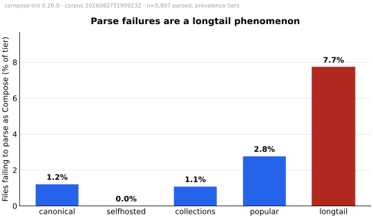

# State of Docker Compose Security

> This is the canonical, citable version of the State of Docker Compose Security report. Tracking issue: [#186](https://github.com/tmatens/compose-lint/issues/186).
>
> Pinned to **compose-lint 0.16.0** and corpus run **`20260811T044906Z`** (5,417 files, 2026-08-11).
>
> **Revised 2026-08-27 — same measurement, re-cut attribution.** The snapshot, the lint run, and the tool version are unchanged; what changed is how files are attributed to tiers. A composition analysis split the corpus into seven tiers: test *inputs* to compose tooling (`synthetic`, 476 files — docker/compose e2e fixtures and the like) and deliberately-vulnerable lab environments (`lab`, 310 files — vulhub, CTF archives) are now excluded from every prevalence claim, and template-collection repos (`collections`, 1,485 files) are split out of `popular`. Every figure below is a re-partition of the same underlying results — unlike a new edition, the pre- and post-revision figures are mappable 1:1. The headline moved from 91% to 89.9%; the largest correction is to the `popular` tier, which previously blended two populations with a 2× security gap.
>
> **This edition is a new baseline, not a refresh of the previous one.** The 6,444-file corpus the 0.7.0 edition was pinned to no longer exists, and it cannot be rebuilt: its `longtail` tier was a stratified GitHub code-search sweep, and GitHub does not reproduce that sweep. The rule set changed underneath it as well. Two variables moved at once, so **no delta across the two editions is measurable, and none is presented here** — figures from the 0.7.0 edition are not repeated as like-for-like comparisons, because they were not measured the same way. The snapshot behind this edition is archived rather than left in a cache directory, so the discontinuity does not happen twice, and refreshes measured against it can carry a delta callout.

The first published empirical study of security misconfigurations in real-world Docker Compose files at corpus scale.

## TL;DR

- **90% of real-world public Docker Compose files** that successfully parse ship with at least one security finding (4,044 of 4,499 parsed files across the five prevalence tiers of a 5,417-file corpus; test fixtures and lab environments are counted separately).
- **Popular projects' own compose files are the worst population in the corpus.** With template collections, test fixtures, and vuln-lab repos split out, the `popular` tier — ordinary ≥50★ projects' own service definitions — runs **99.6% with findings at 19.8 findings per file**, roughly twice any template tier, and 16.4% of them mount a host control socket.
- **Even canonical vendor examples are not clean.** The canonical tier — the awesome-compose / bitnami / grafana / vaultwarden examples people copy-paste — averages 10.4 findings per file, and 77.7% of those files carry at least one.
- **The same four rules lead every tier:** filesystem not read-only, no capability restrictions, no resource limits, privilege escalation not blocked. Each fires on 88–89% of parsed files, and their order barely changes between vendor examples and the longtail.
- **9.5% of longtail files fail to parse as a v2/v3 Compose file at all** — almost entirely shape errors (someone wrote `services` as a string-valued mapping instead of a service-mapping), not malformed YAML. We treat the parse-error population as a finding, not a discard.
- **Every one of the 25 rules fires on real files.** None is dead — even with the synthetic and lab tiers excluded, all 25 fire in the prevalence tiers — and there were zero crashes and zero timeouts across all 5,279 linted files.

The framing is descriptive, not inferential. Read [§ What this study does NOT claim](#what-this-study-does-not-claim) before citing any number from this report.

## Methodology

### Corpus

The corpus lives outside the repo at `~/.cache/compose-lint-corpus/`. Each unique compose file is stored by content hash; an index file maps content hash → source repo, path, blob SHA, and tier. The fetch + lint pipeline is in [`scripts/corpus/`](https://github.com/tmatens/compose-lint/tree/main/scripts/corpus). All numbers in this report come from corpus run `20260811T044906Z` (2026-08-11).

The corpus is divided into seven tiers, each with a distinct framing. Five carry prevalence claims; two are excluded from them (marked ✗) — they are corpus members and useful lint fuel, but not real-world deployment intent. The attribution rules and the measurements behind the split live in [`scripts/corpus/README.md`](https://github.com/tmatens/compose-lint/blob/main/scripts/corpus/README.md#tiers) and `scripts/corpus/retier.py`.

| Tier | Files | Prevalence | What it represents |
| --- | ---: | :---: | --- |
| `canonical` | 249 | ✓ | Official upstream examples (awesome-compose, bitnami, grafana, vaultwarden, …). *Do the examples people copy-paste ship insecure defaults?* |
| `selfhosted` | 596 | ✓ | Curated app-store / template-registry repos (CasaOS-AppStore, runtipi-appstore, Compose-Examples, dockge, …). Distinct threat model: home-LAN deployments, not cloud. |
| `collections` | 1,485 | ✓ | Template/recipe collection repos (≥20 corpus entries from one repo — vimagick/dockerfiles, laradock, ScaleTail, …): curated example libraries that happened to clear the popular tier's star bar. |
| `popular` | 1,231 | ✓ | Ordinary high-star (≥50) projects' **own** compose files, pushed in the last two years. *What does production-adjacent code look like?* |
| `longtail` | 1,070 | ✓ | Stratified GitHub-code-search sweep across anchor terms × filenames × size buckets — the low-visibility mass of ordinary repos (a homelab, a tutorial follow-along, a half-finished side project), as opposed to the curated, high-attention head. The name is the "long tail" of GitHub *by repo attention*, not a distribution tail in the statistical sense. *What does the median compose file in the wild look like?* |
| `synthetic` | 476 | ✗ | Test *inputs* to compose tooling: files under test/fixture/e2e path segments anywhere, plus whole tool repos (docker/compose, podman-compose, kompose). Minimal snippets that omit every hardening key by construction (98.3% with findings). |
| `lab` | 310 | ✗ | Deliberately-vulnerable environments: vulhub CVE reproductions, CTF challenge archives. Measured, they *dilute* rather than inflate (0.7% of files carry a CRITICAL; none mounts a control socket) — excluded on intent, not direction. |

Examples, templates, and demos are deliberately **not** synthetic: copy-paste material is exactly the population the `canonical`, `selfhosted`, and `collections` tiers exist to measure. Only test inputs and lab targets are excluded.

Tier sizes are a property of the sweep that built this snapshot, not a designed allocation, and they differ from the previous edition's. The `longtail` tier in particular is whatever the code-search sweep returned on the day it ran — which is exactly why it does not reproduce.

The longtail sweep is **not random sampling.** GitHub's code-search API has no random-document primitive, so `fetch.py` runs 6 anchors × 4 filenames × 5 size buckets = 120 stratified queries × up to 200 hits each, deduped on `(repo, path, sha)` then on content hash. The exact query design and inherited biases are documented in [`scripts/corpus/README.md`](https://github.com/tmatens/compose-lint/blob/main/scripts/corpus/README.md#longtail-sampling-methodology).

### Tool

All findings come from [compose-lint 0.16.0](https://github.com/tmatens/compose-lint/releases/tag/v0.16.0) — **25 rules** — running with `--fail-on low` (so every severity is reported, not gated). Each rule cites OWASP, CIS, or Docker docs; rule definitions are in [`docs/rules/`](rules/). The version pin matters: when a new rule lands or an existing rule's severity changes, the headline percentages move.

Severities in this edition come from the derived two-axis model in [`docs/severity.md`](severity.md): a rule's tier is what the matrix produces for its cell under a stated attacker baseline and the grounded Docker posture, not a number chosen per rule. Any severity read off this page describes that model. It is the reason the tier shares here cannot be compared against an edition built on an earlier model, even setting the corpus change aside.

### Severity weights

For ranking rules by overall impact within a tier we use a doubled weighting: **CRITICAL = 8, HIGH = 4, MEDIUM = 2, LOW = 1**. Doubling per step keeps a single CRITICAL finding visible against a flood of MEDIUMs while still letting very common HIGHs surface. The per-rule tables in this report show raw hit counts and files-affected as well, so a reader who prefers a different curve can re-rank.

## Findings overview

Across the 4,499 successfully-parsed files in the five prevalence tiers:

| Metric | Value |
| --- | ---: |
| Files with ≥1 finding | 4,044 (89.9%) |
| Files clean | 455 (10.1%) |
| Total findings | 53,723 |
| Findings per file (mean) | 11.9 |
| Findings per file (median) | 7 |
| Findings per file (max) | 323 |

Severity distribution across the 53,723 findings:

| Severity | Count | Share |
| --- | ---: | ---: |
| CRITICAL | 687 | 1.3% |
| HIGH | 3,051 | 5.7% |
| MEDIUM | 40,943 | 76.2% |
| LOW | 9,042 | 16.8% |


The MEDIUM-heavy distribution is a property of compose-lint's rule design, not of the corpus: the hardening misses that fire on nearly every file — capability restrictions, no-new-privileges, resource limits — sit at MEDIUM, so a near-universal rule contributes tens of thousands of findings to one tier. CRITICAL findings are rarer, because they require something acutely dangerous like a mounted control socket, but they are not marginal: **11.0% of parsed files (497 of 4,499) carry at least one CRITICAL finding**, and 8.2% carry a mounted host control socket specifically.

Broadening to HIGH-or-above, **34.2% of parsed files (1,540) carry at least one finding rated HIGH or CRITICAL.** Roughly a third of public Compose files contain something the model rates as an active dangerous grant rather than a missing flag.

If you remember a much larger HIGH-or-above share from the previous edition, that is a rule-model difference, not a change in what people write — the derived model moved several near-universal rules off HIGH, most consequentially the published-port rule. It cannot be quantified as a delta, because the corpus changed at the same time.

**LOW is one rule.** The 9,042 LOW findings (16.8%) look like a substantial tier and are almost entirely a single rule: [CL-0007](rules/CL-0007.md) (filesystem not read-only) accounts for 9,020 of them, or 99.8%. The remaining 22 come from [CL-0014](rules/CL-0014.md) (logging driver disabled, 14), [CL-0022](rules/CL-0022.md) (tmpfs re-enables exec/suid/dev, 5), and [CL-0017](rules/CL-0017.md) (shared mount propagation, 3) — rules that fire only when a file *explicitly* opts out of a default, a deliberate and uncommon act rather than an omission. Read the LOW tier as "almost every file omits `read_only: true`", not as a broad population of small problems.

## Per-tier breakdown

Tier-level rates differ enough that aggregate "X% of compose files have finding Y" numbers can mislead. A vendor example, a self-hosted app-store template, and a random GitHub file have different authorship, different intent, and different review pressure.

### Files with at least one finding

| Tier | Total | Parsed | With findings | Clean | Rate (of parsed) | Findings per parsed file |
| --- | ---: | ---: | ---: | ---: | ---: | ---: |
| `canonical` | 249 | 247 | 192 | 55 | 77.7% | 10.43 |
| `selfhosted` | 596 | 596 | 596 | 0 | **100.0%** | 9.32 |
| `collections` | 1,485 | 1,472 | 1,312 | 160 | 89.1% | 8.85 |
| `popular` | 1,231 | 1,216 | 1,211 | 5 | **99.6%** | **19.83** |
| `longtail` | 1,070 | 968 | 733 | 235 | 75.7% | 8.72 |


The excluded tiers, for transparency: `synthetic` 470 parsed, 98.3% with findings, 11.20 per file (minimal fixtures omit every hardening key by construction — including them would inflate every rate above); `lab` 310 parsed, 100% with findings, 8.87 per file.

Notable observations:

- **Ordinary projects' own compose files are the worst population in the corpus — by a factor of two.** Only 5 of 1,216 parsed `popular` files are clean, and the tier averages 19.83 findings per file against 8.5–10.4 for every template tier. The pre-revision blend (95.0% at 13.29) understated this: three fifths of the old tier was template collections at 8.85 findings per file, and averaging the two populations described neither. When someone writes a compose file *for their own service* rather than as an example for others, hardening is essentially absent.
- **Every `selfhosted` file has at least one finding.** The app-store templates ship with optimistic defaults — they target a home-LAN audience and frequently expose ports on `0.0.0.0`, run as root, mount large host paths, and skip the hardening flags. The fact that 100% of these files trigger compose-lint remains the central finding of this tier.
- **Canonical is the cleanest curated tier and still 78% with findings.** The vendor examples that READMEs tell users to copy-paste are not hardening exemplars — they're configuration demos. That's the gap this report is documenting. (The pre-revision 83.7% was partly an artifact: 27% of the old tier was docker/compose's e2e fixtures, now attributed to `synthetic`.)
- **Collections sit between the curated head and the longtail** — 89.1% at 8.85 findings per file: better-groomed than random files, no more hardened than app-store templates.

### Severity distribution per tier

| Tier | CRITICAL | HIGH | MEDIUM | LOW |
| --- | ---: | ---: | ---: | ---: |
| `canonical` | 23 | 212 | 1,925 | 417 |
| `selfhosted` | 67 | 318 | 4,287 | 885 |
| `collections` | 192 | 794 | 9,887 | 2,158 |
| `popular` | 339 | 1,295 | 18,410 | 4,075 |
| `longtail` | 66 | 432 | 6,434 | 1,507 |

CRITICAL findings concentrate in `popular` (339 of 687, 49% of all CRITICAL findings in the prevalence tiers, from 27% of the parsed files). Normalising to the share of each tier's parsed files carrying a mounted host control socket ([CL-0001](rules/CL-0001.md), the dominant CRITICAL rule) makes the gap starker: `popular` **16.4%**, `collections` 6.7%, `canonical` 6.1%, `selfhosted` 5.2%, `longtail` 2.5%. Ordinary projects mount the control socket six and a half times as often as the longtail and two and a half times as often as any template tier — the pre-revision blend reported 9.9% for this population.

## Top findings

Ten rules account for 98% of all findings. They cluster into three groups: hardening defaults that nobody flips, supply-chain shortcuts, and acute privilege grants.

![Horizontal bar chart of the ten most common rules by share of parsed files affected, coloured by severity: CL-0007 read_only 89% (LOW), CL-0006 cap_drop ALL 89% (MEDIUM), CL-0026 No resource limits 88% (MEDIUM), CL-0003 no-new-privileges 88% (MEDIUM), CL-0005 Ports published on 0.0.0.0 66% (MEDIUM), CL-0019 Image tags without digest pins 48% (MEDIUM), CL-0004 Unpinned image tags 47% (MEDIUM), CL-0020 Credential-shaped environment keys 20% (HIGH), CL-0001 Host control socket exposed 8% (CRITICAL), CL-0011 Strong host-adjacent capabilities 4% (HIGH).](assets/top-findings.svg)

### Hardening defaults (the bulk of the findings)

These four rules fire on roughly 90% of every parsed file in the prevalence tiers:

| Rule | Severity | Files affected | Share of parsed |
| --- | --- | ---: | ---: |
| [CL-0007](rules/CL-0007.md) Filesystem not read-only | LOW | 4,023 | 89.4% |
| [CL-0006](rules/CL-0006.md) No capability restrictions | MEDIUM | 4,017 | 89.3% |
| [CL-0026](rules/CL-0026.md) No resource limits | MEDIUM | 3,959 | 88.0% |
| [CL-0003](rules/CL-0003.md) Privilege escalation not blocked | MEDIUM | 3,951 | 87.8% |

Each is a *missing hardening flag* rather than an active misuse — the file isn't doing something dangerous, it's failing to opt into a defense-in-depth control, which is why the derived model rates them MEDIUM or LOW rather than HIGH. The fact that each fires on ~90% of files is the central observation of the report: the Compose hardening set (`read_only: true`, `cap_drop: [ALL]`, `security_opt: [no-new-privileges:true]`, and a `deploy.resources.limits` block) is essentially never set.

The four move together. They are not four independent habits but one: a service definition written without a hardening pass at all.

### Network and supply-chain shortcuts

| Rule | Severity | Files affected | Share of parsed |
| --- | --- | ---: | ---: |
| [CL-0005](rules/CL-0005.md) Ports bound to all interfaces | MEDIUM | 2,945 | 65.5% |
| [CL-0019](rules/CL-0019.md) Image tag without digest | MEDIUM | 2,143 | 47.6% |
| [CL-0004](rules/CL-0004.md) Image not pinned to version | MEDIUM | 2,105 | 46.8% |

Nearly two thirds of all parsed files publish at least one port to `0.0.0.0`. The image-pinning pair (CL-0019 + CL-0004) shows that ~48% of files don't pin a digest and ~47% don't even pin a tag — `latest` is still the de facto default in published examples.

### Acute privilege grants

| Rule | Severity | Files affected | Share of parsed |
| --- | --- | ---: | ---: |
| [CL-0020](rules/CL-0020.md) Credential-shaped env key with literal value | HIGH | 914 | 20.3% |
| [CL-0001](rules/CL-0001.md) Host control socket exposed | CRITICAL | 368 | 8.2% |
| [CL-0011](rules/CL-0011.md) Strong host-adjacent capability added | HIGH | 192 | 4.3% |
| [CL-0021](rules/CL-0021.md) Credential embedded in connection-string env value | HIGH | 144 | 3.2% |
| [CL-0008](rules/CL-0008.md) Host network mode | HIGH | 131 | 2.9% |
| [CL-0013](rules/CL-0013.md) Sensitive host path exposed | HIGH | 108 | 2.4% |
| [CL-0002](rules/CL-0002.md) Privileged mode enabled | CRITICAL | 108 | 2.4% |
| [CL-0024](rules/CL-0024.md) Host-code-execution capability added | CRITICAL | 49 | 1.1% |
| [CL-0025](rules/CL-0025.md) Root-equivalent host path mounted writable | CRITICAL | 30 | 0.7% |

These are the rules where a finding indicates an *active* dangerous configuration, not a missing flag. Two observations:

- **Plaintext credentials are the most common acute finding by a wide margin.** CL-0020 fires on 20.3% of parsed files — roughly one in five commits a literal value to an environment variable that looks like a credential (e.g. `DB_PASSWORD: hunter2`). Adding CL-0021's connection-string variant, better than one in five public Compose files carries a credential in cleartext.
- **The container-escape rules are rare but not negligible.** A mounted host control socket (CL-0001, 8.2%) and `privileged: true` (CL-0002, 2.4%) each grant root-equivalent host access. Together with the capability and host-path rules, they are what lifts the CRITICAL-carrying share to 11.0% of parsed files.

The remaining rules each fire on at most 1.5% of files: [CL-0018](rules/CL-0018.md) explicit root user (1.5%), [CL-0009](rules/CL-0009.md) security profile disabled (0.9%), [CL-0010](rules/CL-0010.md) host namespace sharing (0.5%), [CL-0027](rules/CL-0027.md) bounded-grant capability (0.3%), [CL-0014](rules/CL-0014.md) logging driver disabled (0.2%), [CL-0016](rules/CL-0016.md) dangerous host device (0.1%), [CL-0022](rules/CL-0022.md) tmpfs re-enables exec/suid/dev (0.1%), [CL-0017](rules/CL-0017.md) shared mount propagation (0.1%), and [CL-0028](rules/CL-0028.md) host-reaching capability (one file). A rule at this rate is not dead — it is specific, and the corpus is large enough to find its handful of real instances.

## Parse errors as a finding

132 of the 4,631 prevalence-tier files (2.9%) did not lint as a v2 or v3 Compose file (the excluded tiers add 6 more, all in `synthetic`). The dominant class is shape errors — files that don't match the Compose schema's expected structure — not malformed YAML.

| Class | Count | Description |
| --- | ---: | --- |
| `services-not-mapping` | 55 | The top-level `services` key is something other than a mapping (commonly a list or a scalar) |
| `service-not-mapping` | 32 | A specific service is a scalar instead of a mapping (e.g., `db: "postgres:14"`) |
| `invalid-yaml` | 23 | YAML scanner / parser error |
| `empty-file` | 8 | File parsed to nothing |
| `other` | 5 | Not a parse failure — all five are files using `include:`, which compose-lint declines to lint because it does not resolve included files (see below) |
| `missing-services-key` | 5 | No `services:` at the top level (likely an `extends:`-only fragment or an old v1 file) |
| `top-level-not-mapping` | 4 | Root document is a list or scalar |

**Five of the 132 are not errors.** They are `include:` files, which compose-lint deliberately refuses rather than lints: the services live in other files it does not resolve, so linting what is written would report a misleading clean result. They land in the same exit-2 population as genuine parse failures and are counted here for completeness; the real parse-failure count is 127 (2.7%).

The per-tier rate is the load-bearing number:

| Tier | Parse-error rate | Dominant class |
| --- | ---: | --- |
| `canonical` | 0.8% | invalid-yaml |
| `selfhosted` | 0.0% | — |
| `collections` | 0.9% | invalid-yaml |
| `popular` | 1.2% | invalid-yaml |
| `longtail` | **9.5%** | shape errors (53% + 30%) |



Longtail's parse-error tail isn't malformed YAML. It's people writing `services` as a string-valued mapping, the way a `package.json` `dependencies` block works. A reader skimming a Compose tutorial sees `nginx: image: nginx:1.25` and writes `nginx: nginx:1.25` instead. The parse error here is itself a security-relevant finding: a Compose file that doesn't parse with a real Compose engine isn't deployed by that engine, so these files are documentation, copy-paste fragments, or first-attempts — none of which are getting linted before they ship.

## Related work

Two pieces of prior work are the closest neighbors to this report. Neither publishes a Compose-specific corpus security study, which is why the framing here is "first published empirical study" — but the framing is only credible if they are acknowledged.

- **Ibrahim, Truong, Wadia, Zhang & Wahsheh (EMSE 27(1), 2021).** *A study of how Docker Compose is used to compose multi-component systems.* [Springer link.](https://link.springer.com/article/10.1007/s10664-021-10025-1) The closest existing corpus study of Docker Compose. Examines composition patterns and architectural shape, not security misconfigurations. This report's tier model is partly informed by their findings on heterogeneity between hobbyist and production Compose usage.
- **Liu, Wang, Tao & Lu (ESORICS 2020).** *A large-scale empirical study of Docker container security.* [Paper PDF.](https://www-users.cse.umn.edu/~kjlu/papers/docker.pdf) A Docker Hub image corpus security study. They flag `docker-compose.yml` as an underexplored attack surface. This report is a direct response to that gap.

## What this study does NOT claim

Read this section before citing any number from the report. The corpus is a descriptive sample, not a randomized population study, and the framing matters for what the findings can and cannot support.

### Out of scope by design

- **Exploit rate.** Findings count *misconfigurations that violate hardening guidance*. The report does not measure how often each misconfiguration is exploited in the wild, which exploits are reachable from the public internet, or which exploits have been observed in incident data. A finding is a code smell with a citation, not an attestation that the file has been compromised.
- **Runtime behavior.** compose-lint reads YAML; it does not run containers. The corpus tells us what people *write* in Compose files, not what their containers actually do once started (network policy, AppArmor profiles, kernel features, secret-injection sidecars, runtime admission controllers).
- **Production usage.** Public GitHub repos are a mix of demos, tutorials, archived projects, app-store templates, and production code. The corpus cannot distinguish them. A `docker-compose.yml` in a public repo is *evidence that someone wrote that compose file*, not evidence that anything is running it.
- **Private-repo prevalence.** The corpus is public-only. Enterprise and internal Compose files are out of scope; their misconfiguration distribution may differ.

### Sampling caveats

- **GitHub-only.** No GitLab, Codeberg, Gitea, Bitbucket, Docker Hub README snippets, package-manager fragments, blog-post YAML blocks, or Stack Overflow answers. The longtail tier is a stratified sweep of GitHub's code search; see [`scripts/corpus/README.md`](https://github.com/tmatens/compose-lint/blob/main/scripts/corpus/README.md#longtail-sampling-methodology) for the exact query design and the four biases it inherits.
- **Filename-pinned.** Files saved under non-standard names (`stack.yml`, `web.compose.yml`, etc.) are missed. The four canonical filenames cover the documented Compose Specification names but not every project's conventions.
- **No statistical inference.** This is descriptive sampling for prevalence estimation. There are no hypothesis tests, no confidence intervals, no population estimates, and no claims about the "average" Compose file outside the five prevalence tiers (`canonical`, `selfhosted`, `collections`, `popular`, `longtail`). Tier counts are reported as observed; treat them as descriptive of the corpus, not extrapolated to all of GitHub.
- **Exclusions are intent judgments.** The `synthetic` and `lab` tiers are excluded from prevalence claims by attribution rules (path segments, curated repo lists, a file-count threshold — see `scripts/corpus/retier.py`). The rules are deterministic and published, but the line they draw — "test input" vs "example", "lab" vs "demo" — is a judgment. Both excluded tiers' numbers are reported alongside the others so a reader who draws the line elsewhere can re-blend.
- **Snapshot in time.** Each report version pins to a single corpus run and a single compose-lint version. The published numbers do not move when a new rule lands; a refresh ships a new version with its own run.
- **Editions are not a time series.** This edition is a new baseline: the corpus behind the previous one is gone and unrebuildable, and the rule set changed at the same time, so the two cannot be differenced. Do not read successive editions of this report as a trend unless the edition explicitly states that it was measured against the same archived snapshot as its predecessor.

### Tool caveats

- **Rules are based on hardening guidance, not on incident response data.** Each rule cites OWASP, CIS, or Docker docs. A rule firing means the file diverges from authoritative hardening guidance, not that an attacker would necessarily exploit the divergence on a given deployment.
- **compose-lint does not validate the full Compose schema.** Files that fail to parse as v2/v3 Compose are bucketed by error class and reported as a separate population, not silently dropped. The parser resolves `${VAR:-default}` interpolation to the value Compose ships when the variable is unset, so rules grade the deployed configuration rather than the source text; a reference with no default is left as written, and external `extends:` files are not merged.

The framing is: *here is what people put in their Compose files at corpus scale, scored against published hardening guidance, with the sampling design and tool boundaries spelled out so you can re-rank, re-bucket, or re-run against your own corpus*. It is not a runtime risk assessment, a CVE database, or a population estimate.

## Reproducibility

The corpus is not committed to the repo (third-party content), but the pipeline that builds it is. **Re-fetching does not reproduce this corpus** — see the note below — so the reproducible path is to lint the archived snapshot:

```bash
git clone https://github.com/tmatens/compose-lint
cd compose-lint
git checkout v0.16.0    # the tool version this report is pinned to
python -m venv .venv && .venv/bin/pip install -e .

# Restore the archived snapshot this edition is measured on.
# sha256 d9be6bbc7a0971a37d0715b5d8ef8b9ef08b64ddd375fc6aebe4e708ffa5e0f5
mkdir -p ~/.cache/compose-lint-corpus
tar -xzf compose-lint-corpus-5417-20260811.tar.gz -C ~/.cache/compose-lint-corpus

# The 2026-08-27 revision's tier attribution and prevalence exclusion
# live in scripts/corpus/ on current main — the v0.16.0 checkout has the
# old four-tier pipeline, and the archived snapshot's index predates the
# re-cut. Lint with the pinned v0.16.0 binary, but run the corpus
# scripts (retier.py, run.py, charts.py) from a main worktree:
git worktree add ../cl-main main
python ../cl-main/scripts/corpus/retier.py

# Lint the corpus and write summary.md + tier_summary.md.
COMPOSE_LINT_BIN=$PWD/.venv/bin/compose-lint python ../cl-main/scripts/corpus/run.py

# Re-render the charts in this report (matplotlib is a maintainer-only extra)
pip install -e '.[corpus]'
python ../cl-main/scripts/corpus/charts.py latest
```

The snapshot archive is not committed to the repo — it is 5,417 third-party files, the same reason the corpus itself isn't committed. It is held by the maintainers and identified by the sha256 above; open an issue on the tracker if you want a copy to verify a number in this report against.

To build a *new* corpus from public GitHub instead — a different sample, not this one — run the four fetchers plus `retier.py` and `enrich_metadata.py` first (`fetch.py`, `fetch_popular.py`, `fetch_canonical.py`, `fetch_selfhosted.py`); they are idempotent and re-running adds new files without re-downloading.

The output lands in `~/.cache/compose-lint-corpus/runs/<UTC-timestamp>/`. The `summary.md` and `tier_summary.md` files there are the source artifacts every table in this report is built from; `charts.py` reads the same per-tier aggregation, so the figures in `docs/assets/` can never disagree with the tables. A run that reports thousands of *crashes* is almost always a `COMPOSE_LINT_BIN` that does not exist — the harness buckets a missing binary as a per-file crash rather than a startup failure. Check the first few results before letting a full run proceed.

**Why re-fetching does not reproduce this corpus.** The curated tiers are enumerable from fixed sources and re-fetch closely, and the tiers derived by re-attribution (`collections`, `synthetic`, `lab`) are deterministic given an index. The `longtail` tier is neither: it is a stratified GitHub code-search sweep, and GitHub's code search neither offers a random-document primitive nor returns a stable result set for the same queries over time. A re-fetch produces *a* longtail tier, not *this* one. That is why the 6,444-file corpus behind the 0.7.0 edition could not be rebuilt once its cache was lost, and why this edition's 5,417-file snapshot is archived as a file rather than trusted to a cache directory. Refreshes measured against the archived snapshot isolate rule-set changes from corpus drift and can legitimately carry a delta; a refresh against a fresh sweep cannot.
